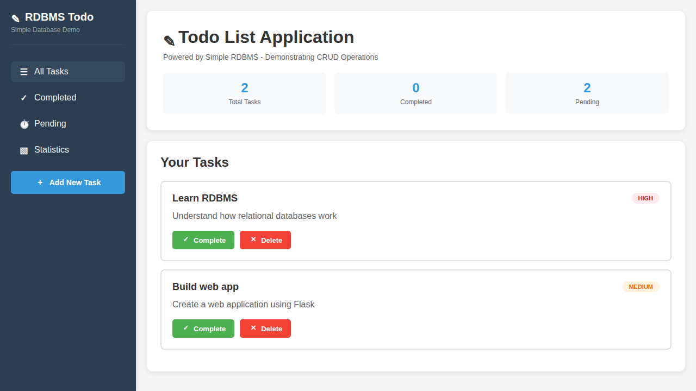
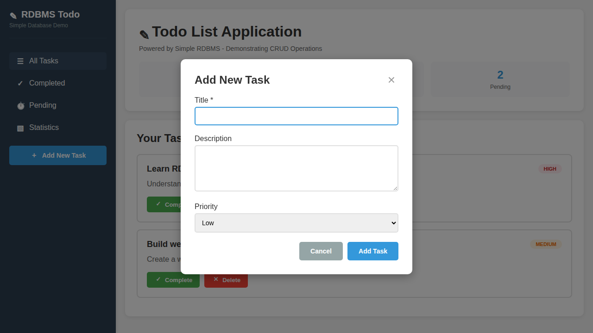
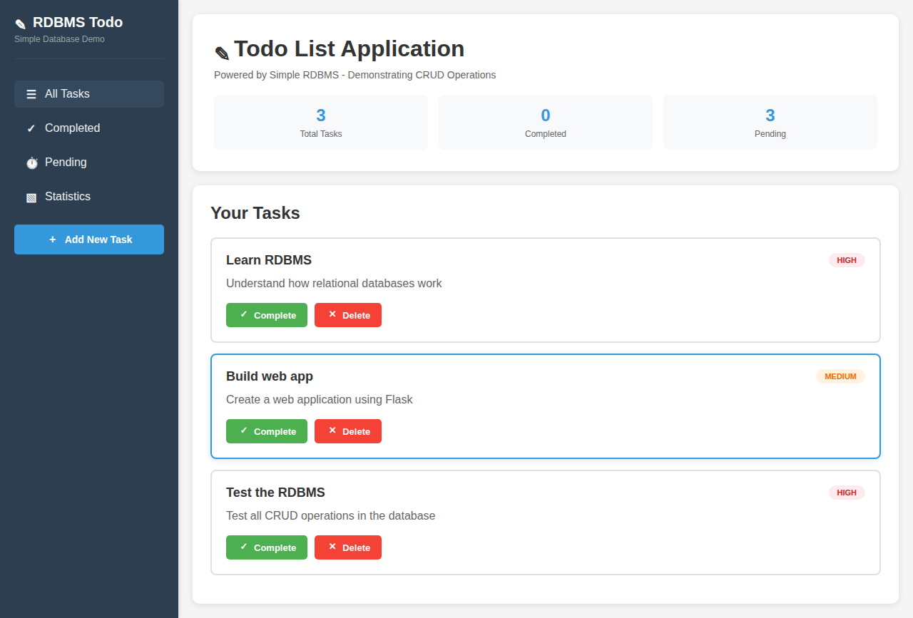
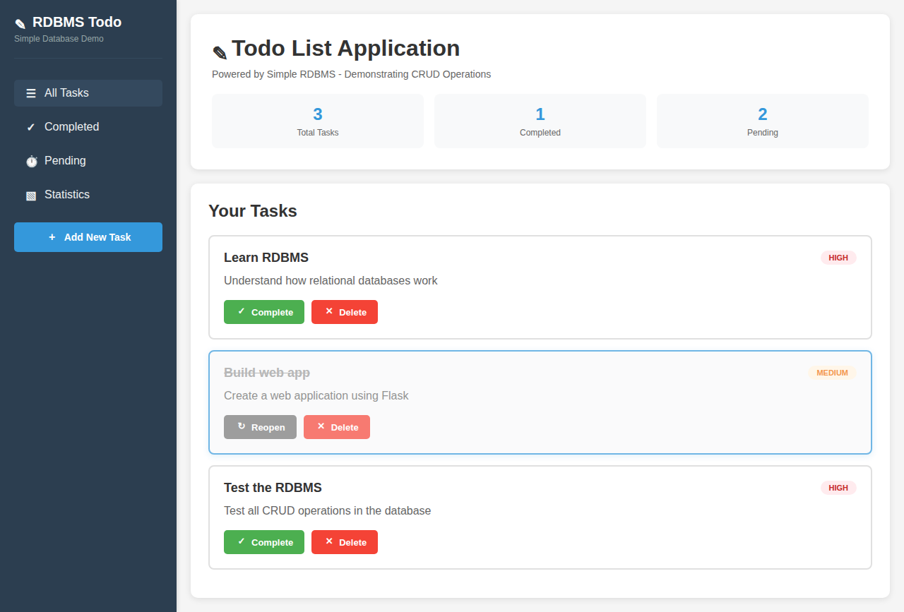

# Simple RDBMS - Relational Database Management System

A lightweight, Python-based relational database management system with SQL-like interface and an interactive REPL mode.

## Features

### Core RDBMS Features
- **Data Types**: Support for INT, VARCHAR, FLOAT, and BOOLEAN
- **Table Management**: CREATE TABLE, DROP TABLE, DESCRIBE
- **CRUD Operations**: INSERT, SELECT, UPDATE, DELETE
- **Constraints**: PRIMARY KEY, UNIQUE, NOT NULL
- **Indexing**: Automatic indexing on primary/unique keys, manual index creation
- **Joins**: INNER JOIN and LEFT JOIN support
- **Persistence**: JSON-based storage for database state
- **REPL Mode**: Interactive SQL command-line interface

### SQL-Like Interface
Supports standard SQL syntax for common operations:
- `CREATE TABLE`, `DROP TABLE`
- `INSERT INTO ... VALUES`
- `SELECT ... FROM ... WHERE`
- `UPDATE ... SET ... WHERE`
- `DELETE FROM ... WHERE`
- `INNER JOIN`, `LEFT JOIN`
- `CREATE INDEX`
- `SHOW TABLES`, `DESCRIBE`

## Installation

1. Clone the repository:
```bash
git clone https://github.com/davidongora/junior-26.git
cd junior-26
```

2. Install dependencies:
```bash
pip install -r requirements.txt
```

## Usage

### Interactive REPL Mode

Start the interactive database shell:

```bash
python rdbms.py
```

Example session:
```sql
SQL> CREATE TABLE users (id INT PRIMARY KEY, name VARCHAR(50), age INT)
Table users created successfully

SQL> INSERT INTO users (id, name, age) VALUES (1, 'Alice', 30)
1 row inserted

SQL> INSERT INTO users (id, name, age) VALUES (2, 'Bob', 25)
1 row inserted

SQL> SELECT * FROM users
+----+-------+-----+
| id | name  | age |
+----+-------+-----+
| 1  | Alice | 30  |
| 2  | Bob   | 25  |
+----+-------+-----+
2 row(s) returned

SQL> UPDATE users SET age = 31 WHERE id = 1
1 row(s) updated

SQL> SELECT * FROM users WHERE age > 28
+----+-------+-----+
| id | name  | age |
+----+-------+-----+
| 1  | Alice | 31  |
+----+-------+-----+
1 row(s) returned

SQL> DELETE FROM users WHERE id = 2
1 row(s) deleted

SQL> SHOW TABLES
+-------+
| users |
+-------+

SQL> DESCRIBE users
+--------+--------------+----------+-----+
| Column | Type         | Nullable | Key |
+--------+--------------+----------+-----+
| id     | INT          | NO       | PRI |
| name   | VARCHAR(50)  | YES      |     |
| age    | INT          | YES      |     |
+--------+--------------+----------+-----+
```

### Programmatic Usage

```python
from rdbms import RDBMS, Column, DataType

# Initialize database
db = RDBMS(db_name="mydb", data_dir="./data")

# Execute SQL commands
success, result = db.execute("CREATE TABLE products (id INT PRIMARY KEY, name VARCHAR(100), price FLOAT)")

if success:
    print(result)

# Insert data using parameterized queries (recommended for security)
db.execute("INSERT INTO products (id, name, price) VALUES (?, ?, ?)", [1, 'Laptop', 999.99])

# Query data with parameters
success, rows = db.execute("SELECT * FROM products WHERE price > ?", [500])
if success:
    for row in rows:
        print(row)

# Named parameters are also supported
db.execute("INSERT INTO products (id, name, price) VALUES (:id, :name, :price)", 
          {"id": 2, "name": "Mouse", "price": 29.99})
```

### Parameterized Queries

Parameterized queries are now fully supported, providing proper SQL injection prevention:

```python
# Positional parameters (?)
db.execute("SELECT * FROM users WHERE name = ? AND age > ?", ["Alice", 25])

# Named parameters (:name)
db.execute("SELECT * FROM users WHERE name = :name", {"name": "Alice"})

# Safe handling of quotes and special characters
db.execute("INSERT INTO users (id, name) VALUES (?, ?)", [1, "Bob's Diner"])

# Protection against SQL injection
malicious_input = "'; DROP TABLE users; --"
db.execute("INSERT INTO users (id, name) VALUES (?, ?)", [2, malicious_input])
# The malicious input is safely stored as a string value
```

### Joins Example

```sql
SQL> CREATE TABLE users (id INT PRIMARY KEY, name VARCHAR(50))
SQL> CREATE TABLE orders (id INT PRIMARY KEY, user_id INT, product VARCHAR(50))

SQL> INSERT INTO users (id, name) VALUES (1, 'Alice')
SQL> INSERT INTO users (id, name) VALUES (2, 'Bob')

SQL> INSERT INTO orders (id, user_id, product) VALUES (1, 1, 'Laptop')
SQL> INSERT INTO orders (id, user_id, product) VALUES (2, 1, 'Mouse')
SQL> INSERT INTO orders (id, user_id, product) VALUES (3, 2, 'Keyboard')

SQL> SELECT * FROM users INNER JOIN orders ON users.id = orders.user_id
+----+-------+----+---------+----------+
| id | name  | id | user_id | product  |
+----+-------+----+---------+----------+
| 1  | Alice | 1  | 1       | Laptop   |
| 1  | Alice | 2  | 1       | Mouse    |
| 2  | Bob   | 3  | 2       | Keyboard |
+----+-------+----+---------+----------+
```

## Web Application Demo

A simple todo list web application demonstrating all CRUD operations.

### Running the Web App

```bash
python webapp.py
```

Then open your browser to: `http://127.0.0.1:5000`

### Features
- ✅ Create new tasks with title, description, and priority
- 📖 Read/view all tasks
- ✏️ Update task status (complete/reopen)
- 🗑️ Delete tasks
- 📊 Real-time statistics (total, completed, pending)

The web application uses the RDBMS to store and manage todo items, demonstrating:
- **CREATE**: Add new todos via the form
- **READ**: Display all todos and statistics
- **UPDATE**: Mark todos as complete or reopen them
- **DELETE**: Remove todos permanently

### Screenshots

**Main Application View**



The main interface showing the todo list with tasks, statistics dashboard, and sidebar navigation.

**Adding a New Task**



Modal form for creating new tasks with title, description, and priority fields.

**Task Added Successfully**



The application after successfully adding a new task, showing the updated task list and statistics.

**Completed Task View**



A task marked as complete (shown with strikethrough) with the "Reopen" button, and updated statistics showing 1 completed task.

## Architecture

### Core Components

1. **Column**: Represents table columns with data type and constraints
2. **Index**: Simple B-tree-like structure for fast lookups
3. **Table**: Manages rows, columns, and indexes
4. **Database**: Container for tables with join capabilities
5. **SQLParser**: Parses SQL-like commands into structured operations
6. **RDBMS**: Main interface combining database and parser

### Storage

Data is persisted to JSON files in the `./data` directory:
- One JSON file per database
- Contains table schemas and all row data
- Loaded on initialization, saved after modifications

## Supported SQL Commands

### DDL (Data Definition Language)
- `CREATE TABLE table_name (column_name TYPE constraints, ...)`
- `DROP TABLE table_name`
- `CREATE INDEX index_name ON table_name (column_name)`
- `SHOW TABLES`
- `DESCRIBE table_name`

### DML (Data Manipulation Language)
- `INSERT INTO table_name (col1, col2) VALUES (val1, val2)`
- `SELECT col1, col2 FROM table_name WHERE condition`
- `SELECT * FROM table1 INNER JOIN table2 ON table1.col = table2.col`
- `SELECT * FROM table1 LEFT JOIN table2 ON table1.col = table2.col`
- `UPDATE table_name SET col1 = val1 WHERE condition`
- `DELETE FROM table_name WHERE condition`

### Data Types
- `INT`: Integer numbers
- `VARCHAR(length)`: Variable-length strings
- `FLOAT`: Floating-point numbers
- `BOOLEAN`: True/False values

### Constraints
- `PRIMARY KEY`: Unique identifier, auto-indexed
- `UNIQUE`: Unique values, auto-indexed
- `NOT NULL`: Cannot be null

## Examples

See the interactive REPL mode for live examples by running:
```bash
python rdbms.py
```

Type `help` in the REPL to see command examples.

## Limitations

This is a simple educational RDBMS with the following limitations:
- Single-user (no concurrent access control)
- In-memory operations (not optimized for large datasets)
- Simple query optimizer (no cost-based optimization)
- Basic WHERE clause support (comparison operators with simple AND)
- No transactions or ACID guarantees
- No views, stored procedures, or triggers
- JSON-based storage (not efficient for large data)

## Security Note

**IMPORTANT**: This implementation now includes parameterized query support with proper SQL
injection prevention. The web application demo has been updated to use parameterized queries
throughout.

### Parameterized Queries
The RDBMS now supports:
- Positional parameters using `?` placeholders
- Named parameters using `:name` placeholders
- Automatic escaping and unescaping of special characters
- Safe handling of SQL metacharacters

All user input in the web application is now safely handled through parameterized queries,
eliminating SQL injection vulnerabilities.

For production use, consider:
- Using established database systems (PostgreSQL, MySQL, SQLite, etc.)
- Implementing connection pooling for multi-user scenarios
- Adding transaction support for ACID guarantees
- Using ORM frameworks (SQLAlchemy, Django ORM, etc.)

## License

MIT License
